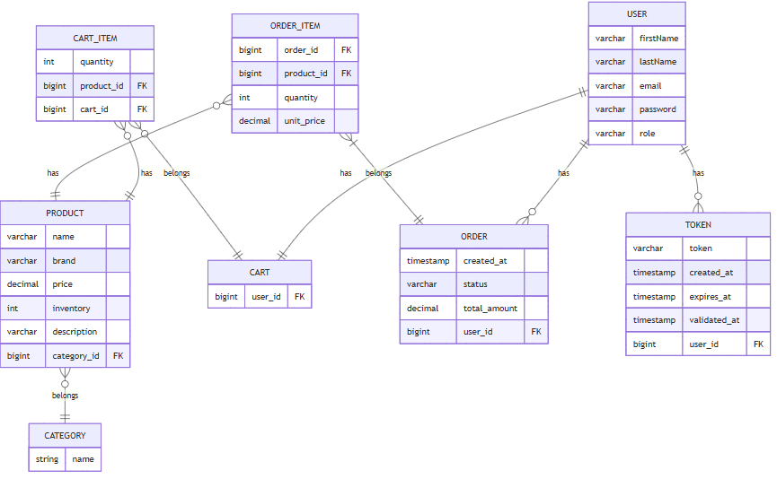
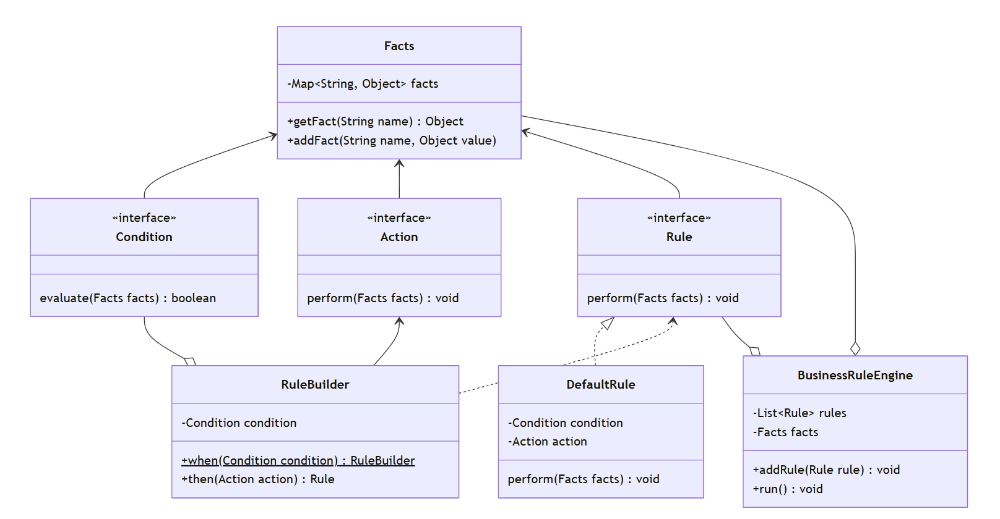

# Online Shop
## Описание
Онлайн Магазин – это веб-приложение для продажи товаров, построенное с использованием Spring Boot. Магазин позволяет пользователям просматривать товары, добавлять их в корзину и оформлять заказ. Администраторы могут управлять каталогом товаров, категориями и пользователями. 
1) Регистрация и авторизация пользователей.
Пользователи могут зарегистрироваться в системе, после чего на электронную почту 
будет отпрвлен код для активации аккаунта. После активации аккаунта пользователь
может аутентифицироваться и получить JWT токен для дальнейшего взамодействия с API
2) Роли. В приложении есть поддержка двух ролей:USER и ADMIN.
- USER способен просматривать все продукты и категории, добавлять продукты в корзину, совершать заказы, смотреть историю зказов
- ADMIN способен совершать те же действия, что и пользователь, а также: добавлять, удалять и изменять категории и продукты в приложении, добавлять изображения продуктов, а также просматривать информацию о всех пользователях и их заказах.
3) Просмотр содержимого интернет-магазина. Чтобы облегчить поиск нужных товаров для пользователей, 
в API добаблена возможность пагинации и фильтрации для продуктов по таким параметрам как: название, фирма, категория.
Данный функционал реализован с помощью Specification API и Spring Data JPA.
4) [Движок бизнес-правил](#диаграмма-классов-движка-бизнес---правил). В построении движка бизнес-правил используется 
идея fluent-API чтобы обеспечить удобный интерфейс определения бизнес правил интернет-магазина.
Данный функционад позволяет гибко настраивать приложение в соответствии с бизнес-требованиями.
Так, например, используя данную возможность, можно очень быстро применять скидку (или бесплатную доставку) 
для определенных категорий пользователей. Это достигается за счет комбинации условий(Condition) и действий(Action).
5) Отправка email нотификаций. Приложение поддерживаает отправку сообщений по электронной почте. 
Сообщения с кодом активации аккаунта отправляются пользоваателям после регистрации. 
После совершения заказа пользователю отправляется сообщение, содержащее детали заказа.
6) Хранение данных. Для хранения данных о [сущностях](#er---диаграмма-предметной-области) используется реляционная БД PostgreSQL.
Миграции БД реализованы с посредством Liquibase.

## Диаграммы

### ER - диаграмма предметной области

### Диаграмма классов движка бизнес - правил

## Технологии
- Java 21
- Spring Boot
- Spring Security
- Spring Data JPA
- Hibernate
- Liquibase
- PostgreSQL
- JWT
- Java MailSender

